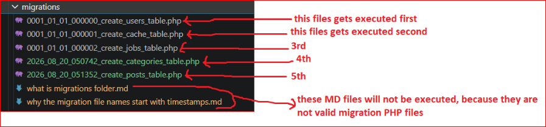

# Why the migration file names start with timestamps?

Migration files in Laravel start with timestamps to ensure that they are executed in the correct order.  

If we change timestamps of any migration file, its placement order in the parent folder will be changed.

- and Laravel will execute it based on its new order  
